# 막내야 뭐 먹을래

## 🚩목차
1. [프로젝트 요약](##📸-프로젝트-요약)
2. [기획 배경](##🎈-기획-배경)
3. [기술 스택](##⚙-기술-스택)
4. [주요 화면](##🎥-주요-화면)
5. [기타 산출물](##📕-기타-산출물)

## 📸 프로젝트 요약
한 줄 설명 : 직장인 점심식사 추천 서비스

기간 : 2024/02/26 ~ 2024/04/05, 6주

**참가 인원**

|                                         장현수                                         |                                        김규현                                         |                                        한규준                                         |                                          권기용                                           |                                         이다은                                         |                                           장청룡(명예)                                            | 
|:-----------------------------------------------------------------------------------:|:----------------------------------------------------------------------------------:|:----------------------------------------------------------------------------------:|:--------------------------------------------------------------------------------------:|:-----------------------------------------------------------------------------------:|:----------------------------------------------------------------------------------------:|
|    |     |    |    |    |    |
|                                       팀장 , BE                                       |                                       BE, FE                                       |                                     Infra, FE                                      |                                           FE                                           |                                         FE                                          |                                            BE                                            |

## 🎈 기획 배경

### 목적
- 점심식사 메뉴 선정이 부담스러운 신입에게 도움을 준다.
- 회사 구성원의 기호를 파악하여 저장한다.

### 현재 상황
- 점심메뉴 추천 압박으로 인한 스트레스가 높다. -> [점심메뉴 추천 때문에 퇴사까지](https://www.hankyung.com/article/202103089954I)

## ⚙ 기술 스택

## FrontEnd

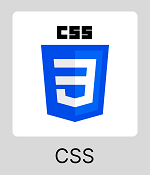
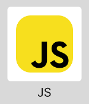
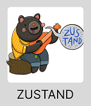

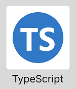

## BackEnd

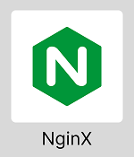
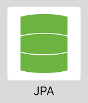

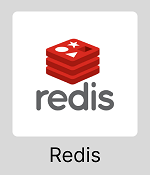
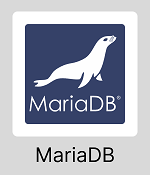
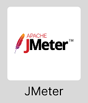
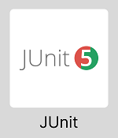

## Infra
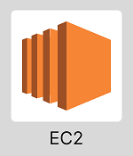
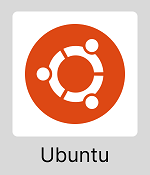

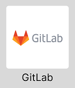
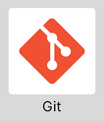
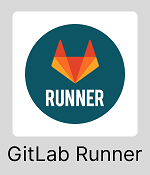

## 🎥 주요 화면

### 먹비티아이(MukBTI)
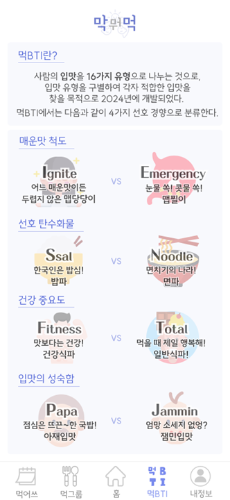

### 먹그룹(MukGroup)
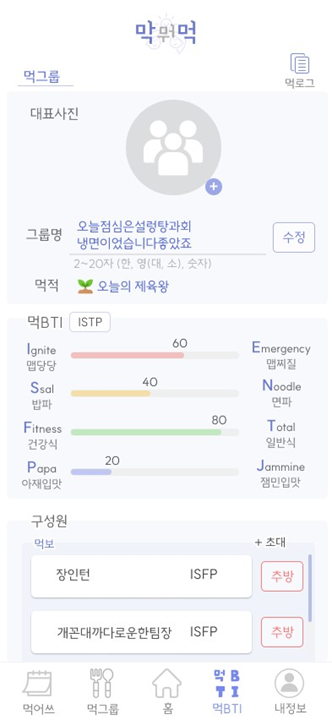

### 먹기록(MukRecord)
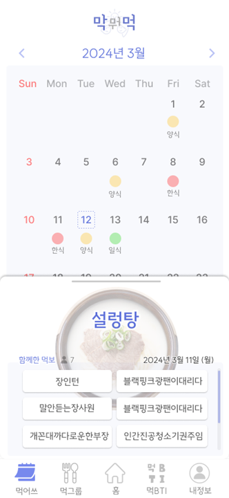

## 📕 기타 산출물

### 아키텍처

### ERD
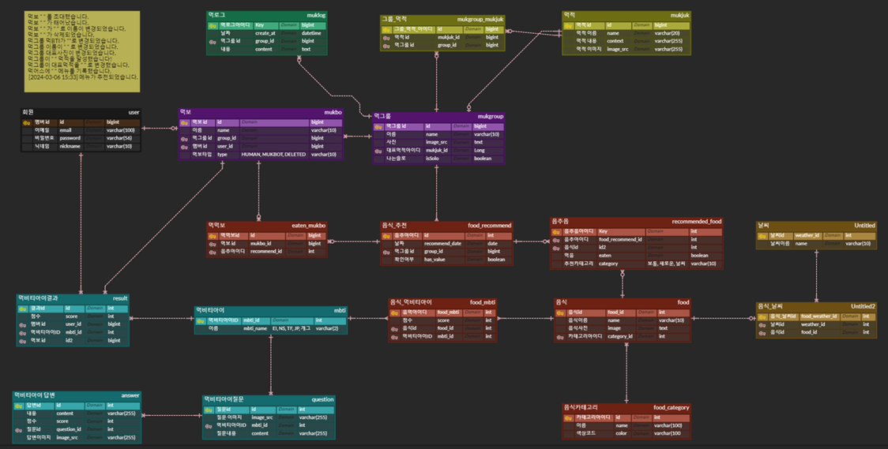

### 플로우차트

### API명세서
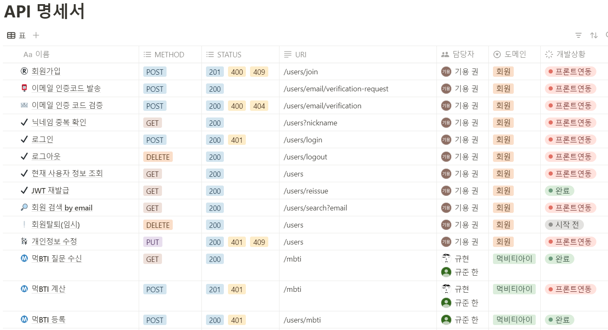
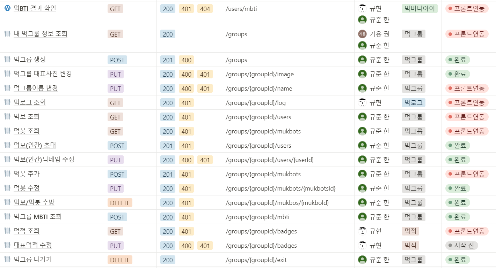
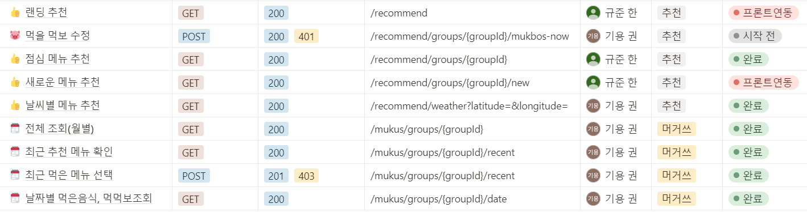